## Game Legacy
With Game Legacy, you can easily store and manage your game 
collection anytime-anywhere.

This repository hosts the official Android APK releases of Game Legacy.

To run the Game Legacy app, you have to downdload the Game-Legacy.apk file 
and install it on your device.
Your device must be running at Android 13 version or newer for full functionality.

Built for gamers, by a gamer.

### With Game Legacy, you can:
- Create and browse your game collection
- Track the status of each game for real-time gameplay monitoring
- Leave reviews for games you've played
- Connect with friends and share collection information
- View collection statistics and insights
- Manage your personal profile
- Listen to music while you browse

### 🎵 Music
All music included in the app is 100% original and composed by me.  
It was created to enhance the user experience and bring an extra layer of immersion.

### Feedback
This app is free to use.
If you’d like to help improve it, you can send your feedback to game-legacy@outlook.com.

## Screenshots

### Menu
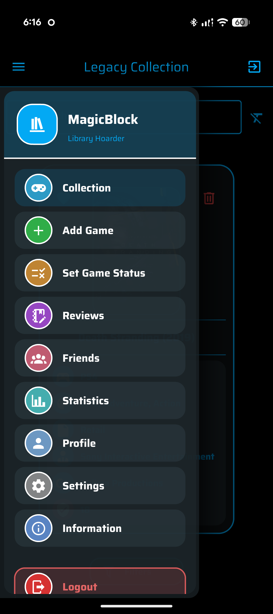

### Collection
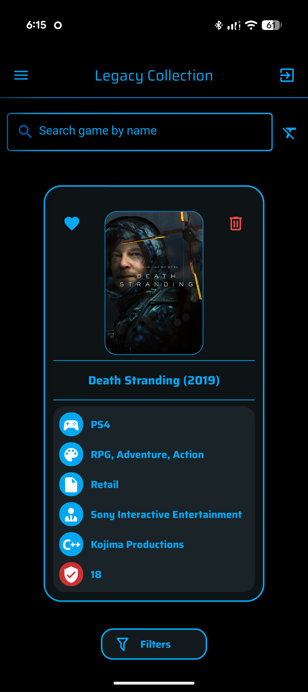

### Filters
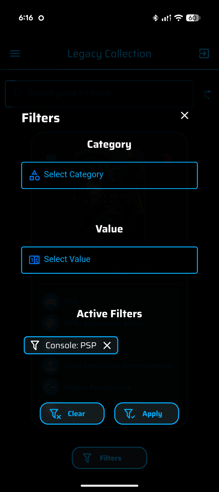

### Add Game
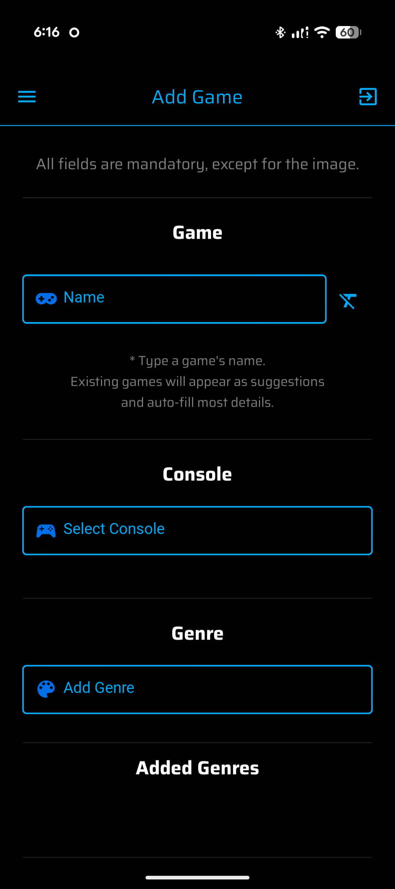

### Game Status
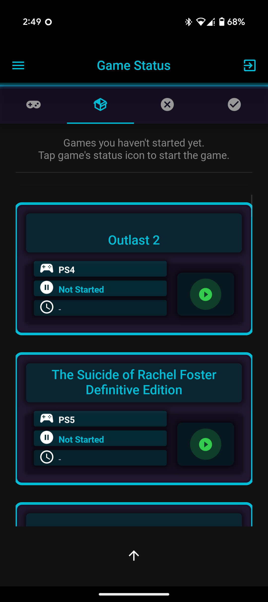

### Game Session
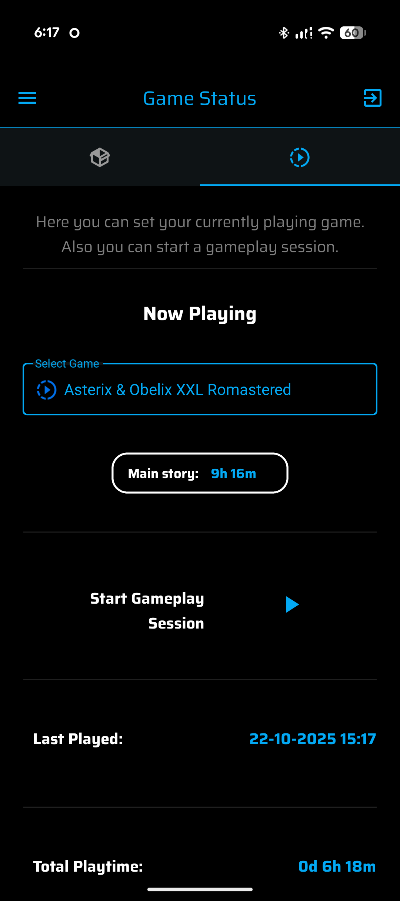

### Add Review
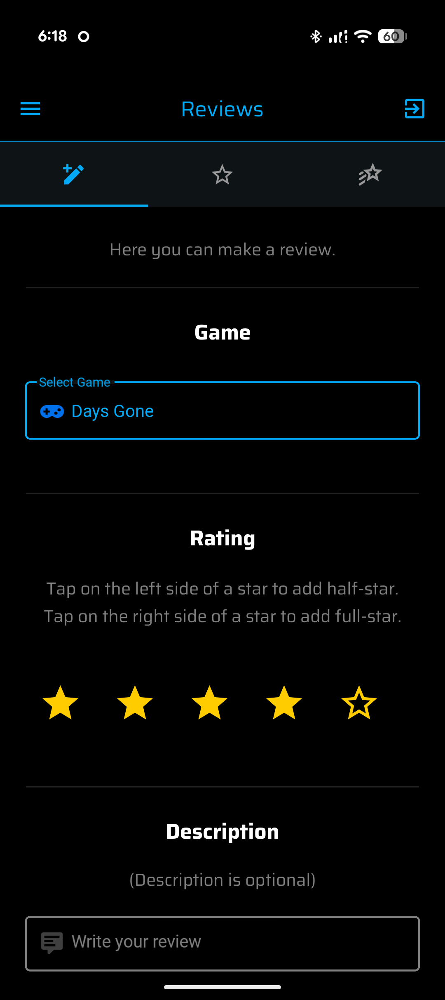

### View Reviews
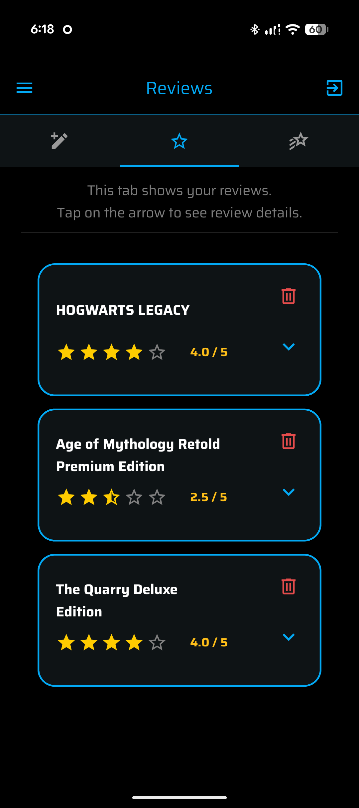

### Friends
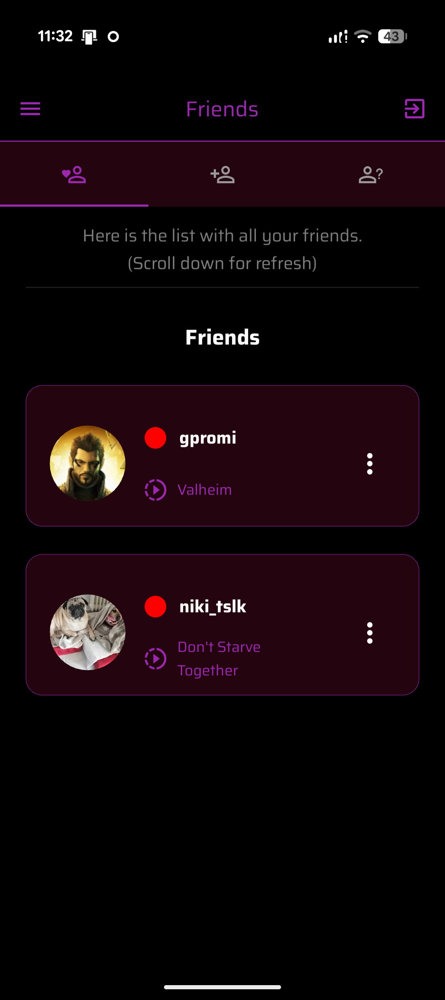

### Statistics
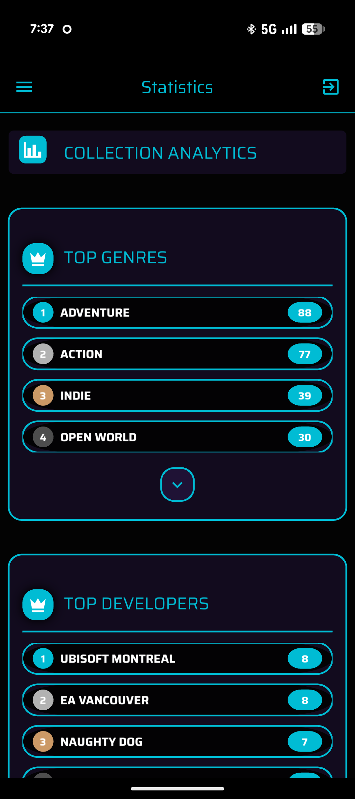

### Profile
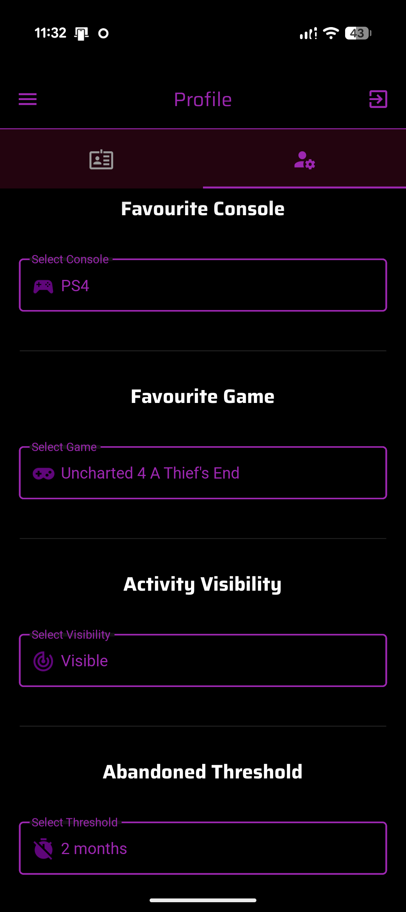

### Settings - Theme
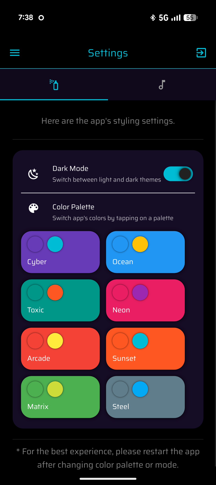
